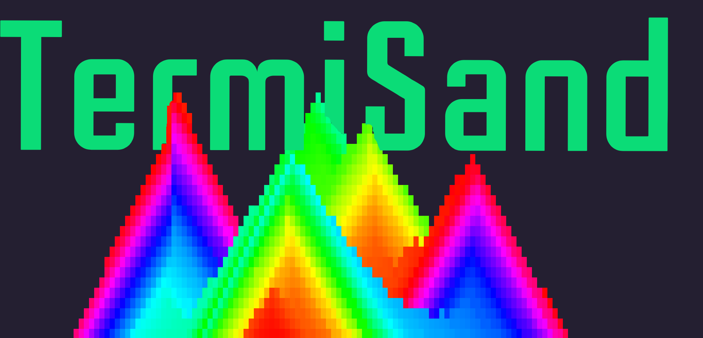
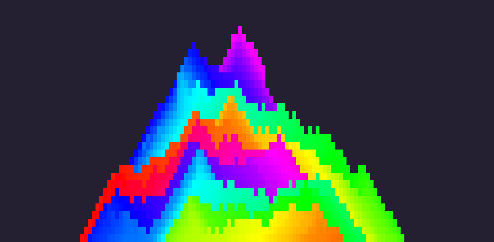

      <h1>  TermiSand</h1>
     

    
    

        
         
    

## Description
TermiSand is a falling sand simulator, but in your terminal!

## Screenshot

## Usage
Run the "TermiSand" executable

and then move your cursor around and enjoy the show!  
to clear the screen press ctrl+r and watch as the sand falls off the screen ready for you to start filling it up again!

## Built with

